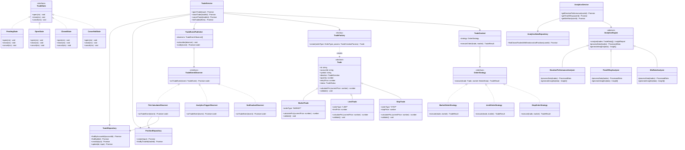

# Class Diagram

```mermaid
classDiagram

    %% ── Trade Model Hierarchy ─────────────────────────────────────────────────
    class Trade {
        <<abstract>>
        +id: string
        +accountId: string
        +symbol: string
        +direction: TradeDirection
        +quantity: number
        +entryPrice: number
        +status: TradeStatus
        +calculatePnL(currentPrice: number) number
        +validate() void
    }
    class MarketTrade {
        +orderType: "MARKET"
        +calculatePnL(currentPrice: number) number
        +validate() void
    }
    class LimitTrade {
        +orderType: "LIMIT"
        +limitPrice: number
        +calculatePnL(currentPrice: number) number
        +validate() void
    }
    class StopTrade {
        +orderType: "STOP"
        +stopPrice: number
        +calculatePnL(currentPrice: number) number
        +validate() void
    }
    Trade <|-- MarketTrade
    Trade <|-- LimitTrade
    Trade <|-- StopTrade

    %% ── TradeFactory ──────────────────────────────────────────────────────────
    class TradeFactory {
        <<factory>>
        +create(orderType: OrderType, params: TradeCreationParams) Trade
    }
    TradeFactory ..> Trade : creates

    %% ── Order Strategy ────────────────────────────────────────────────────────
    class OrderStrategy {
        <<interface>>
        +execute(trade: Trade, market: MarketData) TradeResult
    }
    class MarketOrderStrategy {
        +execute(trade, market) TradeResult
    }
    class LimitOrderStrategy {
        +execute(trade, market) TradeResult
    }
    class StopOrderStrategy {
        +execute(trade, market) TradeResult
    }
    class TradeContext {
        -strategy: OrderStrategy
        +executeOrder(trade, market) TradeResult
    }
    OrderStrategy <|.. MarketOrderStrategy
    OrderStrategy <|.. LimitOrderStrategy
    OrderStrategy <|.. StopOrderStrategy
    TradeContext o--> OrderStrategy

    %% ── State Machine ─────────────────────────────────────────────────────────
    class TradeState {
        <<interface>>
        +open(ctx) void
        +close(ctx) void
        +cancel(ctx) void
    }
    class PendingState {
        +open(ctx) void
        +close(ctx) void
        +cancel(ctx) void
    }
    class OpenState {
        +open(ctx) void
        +close(ctx) void
        +cancel(ctx) void
    }
    class ClosedState {
        +open(ctx) void
        +close(ctx) void
        +cancel(ctx) void
    }
    class CancelledState {
        +open(ctx) void
        +close(ctx) void
        +cancel(ctx) void
    }
    TradeState <|.. PendingState
    TradeState <|.. OpenState
    TradeState <|.. ClosedState
    TradeState <|.. CancelledState

    %% ── Observer ──────────────────────────────────────────────────────────────
    class TradeEventObserver {
        <<interface>>
        +onTradeEvent(event: TradeEvent) Promise~void~
    }
    class TradeEventPublisher {
        -observers: TradeEventObserver[]
        +subscribe(observer) void
        +notify(event) Promise~void~
    }
    class PnLCalculatorObserver {
        +onTradeEvent(event) Promise~void~
    }
    class AnalyticsTriggerObserver {
        +onTradeEvent(event) Promise~void~
    }
    class NotificationObserver {
        +onTradeEvent(event) Promise~void~
    }
    TradeEventObserver <|.. PnLCalculatorObserver
    TradeEventObserver <|.. AnalyticsTriggerObserver
    TradeEventObserver <|.. NotificationObserver
    TradeEventPublisher o--> TradeEventObserver

    %% ── Analytics Engine (Template Method) ───────────────────────────────────
    class AnalyticsEngine {
        <<abstract>>
        +analyze(trades: TradeData[]) InsightReport
        #processData(trades) ProcessedData
        #generateInsights(data) Insight[]
    }
    class EmotionPerformanceAnalyzer {
        #processData(trades) ProcessedData
        #generateInsights(data) Insight[]
    }
    class TimeOfDayAnalyzer {
        #processData(trades) ProcessedData
        #generateInsights(data) Insight[]
    }
    class WinRateAnalyzer {
        #processData(trades) ProcessedData
        #generateInsights(data) Insight[]
    }
    AnalyticsEngine <|-- EmotionPerformanceAnalyzer
    AnalyticsEngine <|-- TimeOfDayAnalyzer
    AnalyticsEngine <|-- WinRateAnalyzer

    %% ── Service → Repository Dependencies ────────────────────────────────────
    class TradeService {
        +openTrade(input) Promise
        +closeTrade(tradeId) Promise
        +cancelTrade(tradeId) Promise
        +listTrades(filters) Promise
    }
    class AnalyticsService {
        +getEmotionPerformance(userId) Promise
        +getTimeOfDay(userId) Promise
        +getWinRate(userId) Promise
    }
    class TradeRepository {
        +findByAccountId(accountId) Promise
        +findById(id) Promise
        +create(input) Promise
        +update(id, input) Promise
    }
    class PositionRepository {
        +create(input) Promise
        +findByTradeId(tradeId) Promise
    }
    class AnalyticsDataRepository {
        +findClosedTradesWithEmotionsAndPositions(userId) Promise
    }
    TradeService --> TradeRepository
    TradeService --> PositionRepository
    TradeService --> TradeEventPublisher
    TradeService --> TradeFactory
    TradeService --> TradeContext
    AnalyticsService --> AnalyticsDataRepository
    AnalyticsService --> AnalyticsEngine
    PnLCalculatorObserver --> PositionRepository
    PnLCalculatorObserver --> TradeRepository
```
