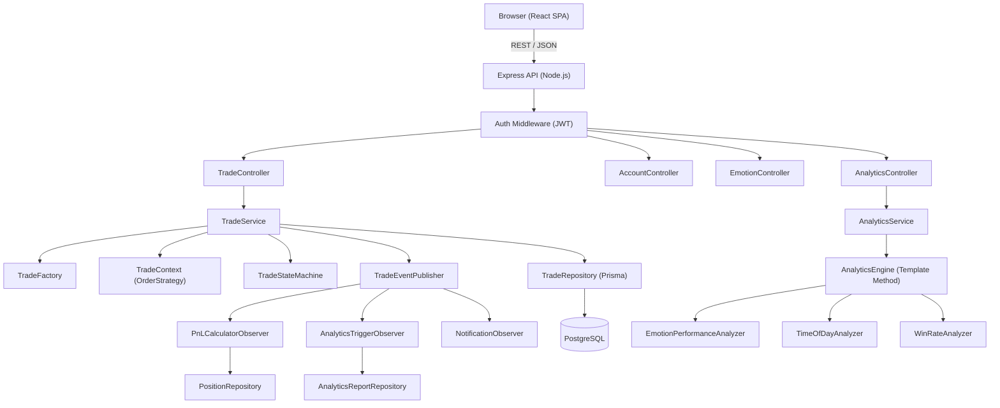

# ShadowTrade — Project Idea

## Description

ShadowTrade is a paper trading platform that bridges the gap between simulated trading and real psychological performance tracking. Users can create virtual trading accounts, open and close trades across stocks and crypto, and simultaneously log their emotional state before and after each trade. The platform then analyses the relationship between emotion and trading outcome — surfacing insights like "you win 70% of trades when Confident but only 30% when FOMO-driven." The goal is to help traders develop discipline and self-awareness before risking real capital.

## Feature List

- **Authentication** — JWT-based register/login with protected routes
- **Multiple Trading Accounts** — create accounts with configurable starting balance and currency
- **Market Data** — real-time-style price quotes (AlphaVantage or Mock fallback)
- **Trade Lifecycle** — open MARKET, LIMIT, and STOP orders; track PENDING → OPEN → CLOSED / CANCELLED states
- **Unrealised P&L** — live price polling for open trades; displays floating profit/loss
- **Realised P&L** — computed on close, persisted as a Position record, displayed on the trade card
- **Emotion Logging** — log PRE-trade and POST-trade emotions (FOMO, CONFIDENT, FEARFUL, GREEDY, ANXIOUS, NEUTRAL) with intensity 1-5
- **Analytics** — three auto-generated insight reports: Emotion vs Performance, Time-of-Day Win Rate, Win Rate by Symbol
- **Analytics Caching** — reports cached in DB and marked stale on trade close; regenerated lazily
- **Observer Notifications** — console notifications on trade open/close/cancel

## Tech Stack

| Layer | Technology |
|---|---|
| Frontend | React 18, TypeScript, Vite, TailwindCSS, Recharts, React Router v6, Axios |
| Backend | Node.js, Express, TypeScript |
| ORM | Prisma |
| Database | PostgreSQL |
| Auth | JWT (jsonwebtoken) |
| Market Data | AlphaVantage API (Mock fallback) |
| Dev Tooling | concurrently, ts-node-dev |
| Deployment | Vercel (frontend), Railway (backend) |

## Architecture Overview

