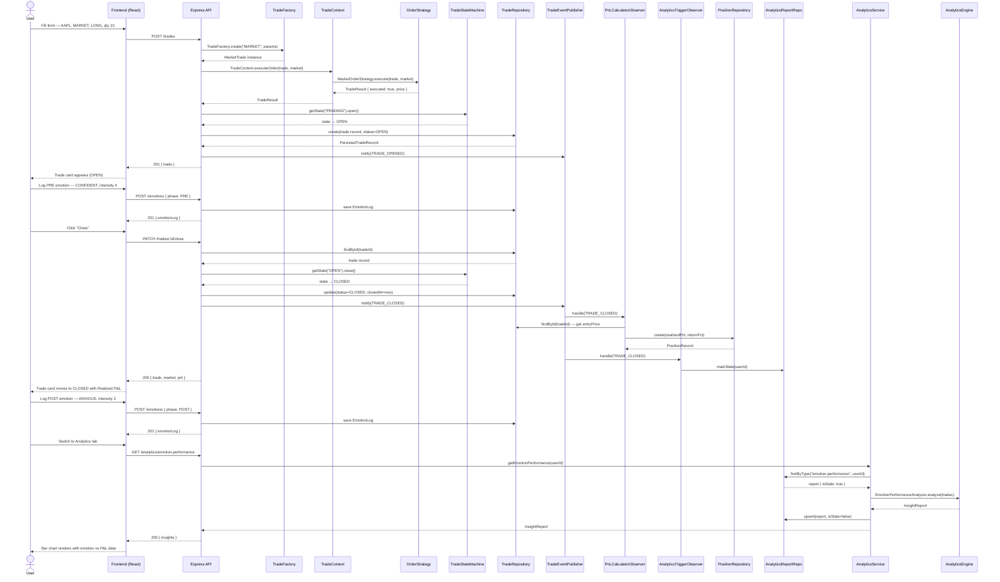

# Sequence Diagram

End-to-end flow: open trade → emotion log → close trade → analytics.

```mermaid
sequenceDiagram
    actor User
    participant FE as Frontend (React)
    participant API as Express API
    participant TF as TradeFactory
    participant CTX as TradeContext
    participant STRAT as OrderStrategy
    participant SM as TradeStateMachine
    participant REPO as TradeRepository
    participant PUB as TradeEventPublisher
    participant PNL as PnLCalculatorObserver
    participant ATO as AnalyticsTriggerObserver
    participant POS as PositionRepository
    participant AREP as AnalyticsReportRepo
    participant SVC as AnalyticsService
    participant ENG as AnalyticsEngine

    User->>FE: Fill form — AAPL, MARKET, LONG, qty 10
    FE->>API: POST /trades
    API->>TF: TradeFactory.create("MARKET", params)
    TF-->>API: MarketTrade instance
    API->>CTX: TradeContext.executeOrder(trade, market)
    CTX->>STRAT: MarketOrderStrategy.execute(trade, market)
    STRAT-->>CTX: TradeResult { executed: true, price }
    CTX-->>API: TradeResult
    API->>SM: getState("PENDING").open()
    SM-->>API: state → OPEN
    API->>REPO: create(trade record, status=OPEN)
    REPO-->>API: PersistedTradeRecord
    API->>PUB: notify(TRADE_OPENED)
    API-->>FE: 201 { trade }
    FE-->>User: Trade card appears (OPEN)

    User->>FE: Log PRE emotion — CONFIDENT, intensity 4
    FE->>API: POST /emotions { phase: PRE }
    API->>REPO: save EmotionLog
    API-->>FE: 201 { emotionLog }

    User->>FE: Click "Close"
    FE->>API: PATCH /trades/:id/close
    API->>REPO: findById(tradeId)
    REPO-->>API: trade record
    API->>SM: getState("OPEN").close()
    SM-->>API: state → CLOSED
    API->>REPO: update(status=CLOSED, closedAt=now)
    API->>PUB: notify(TRADE_CLOSED)

    PUB->>PNL: handle(TRADE_CLOSED)
    PNL->>REPO: findById(tradeId) — get entryPrice
    PNL->>POS: create(realizedPnl, returnPct)
    POS-->>PNL: PositionRecord

    PUB->>ATO: handle(TRADE_CLOSED)
    ATO->>AREP: markStale(userId)

    API-->>FE: 200 { trade, market, pnl }
    FE-->>User: Trade card moves to CLOSED with Realized P&L

    User->>FE: Log POST emotion — ANXIOUS, intensity 2
    FE->>API: POST /emotions { phase: POST }
    API->>REPO: save EmotionLog
    API-->>FE: 201 { emotionLog }

    User->>FE: Switch to Analytics tab
    FE->>API: GET /analytics/emotion-performance
    API->>SVC: getEmotionPerformance(userId)
    SVC->>AREP: findByType("emotion-performance", userId)
    AREP-->>SVC: report { isStale: true }
    SVC->>ENG: EmotionPerformanceAnalyzer.analyze(trades)
    ENG-->>SVC: InsightReport
    SVC->>AREP: upsert(report, isStale=false)
    SVC-->>API: InsightReport
    API-->>FE: 200 { insights }
    FE-->>User: Bar chart renders with emotion vs P&L data
```
