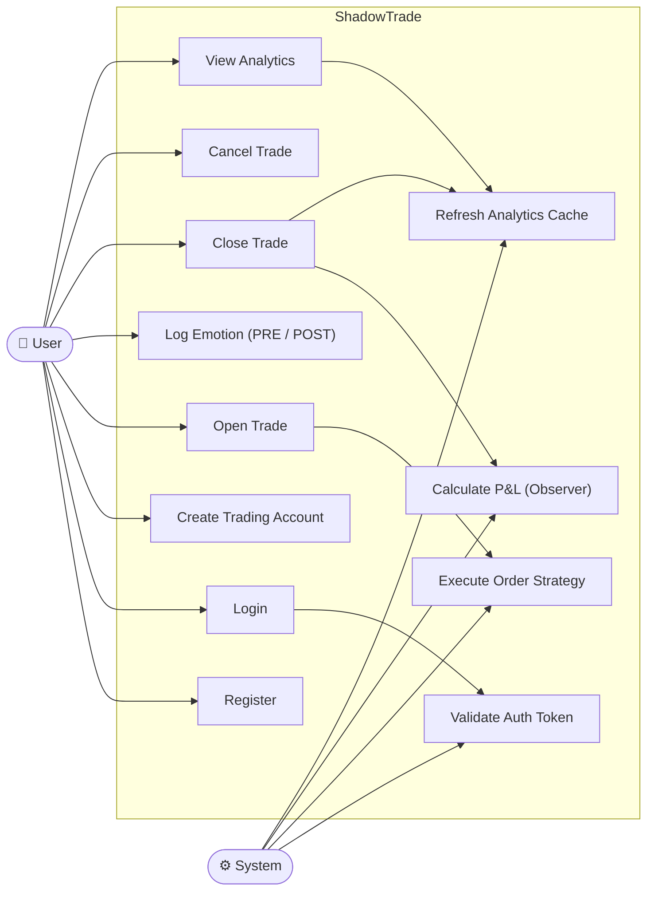

# Use Case Diagram

```mermaid
graph LR
    User(["👤 User"])
    System(["⚙️ System"])

    subgraph ShadowTrade
        UC1["Register"]
        UC2["Login"]
        UC3["Create Trading Account"]
        UC4["Open Trade"]
        UC5["Log Emotion (PRE / POST)"]
        UC6["Close Trade"]
        UC7["Cancel Trade"]
        UC8["View Analytics"]

        SYS1["Validate Auth Token"]
        SYS2["Execute Order Strategy"]
        SYS3["Calculate P&L (Observer)"]
        SYS4["Refresh Analytics Cache"]
    end

    User --> UC1
    User --> UC2
    User --> UC3
    User --> UC4
    User --> UC5
    User --> UC6
    User --> UC7
    User --> UC8

    UC2 --> SYS1
    UC4 --> SYS2
    UC6 --> SYS3
    UC6 --> SYS4
    UC8 --> SYS4

    System --> SYS1
    System --> SYS2
    System --> SYS3
    System --> SYS4
```
